# Desarrollo de Scripts

## Creación de Menú Principal (GUI) 

El menú principal representa la pantalla inicial de navegación del entorno virtual desarrollado en Roblox Studio. Este menú no solo actúa como punto de entrada a la experiencia educativa, sino que también permite el acceso a secciones complementarias como los créditos y los ajustes del sistema.
La imagen corresponde a la pantalla de inicio o menú principal de la experiencia educativa desarrollada en el entorno virtual de Roblox Studio, diseñada para estudiantes de fisioterapia dentro del proyecto académico de anatomía ósea
Esta pantalla cumple la función de ser el punto de entrada a la simulación, permitiendo al usuario elegir entre comenzar la experiencia, acceder a los ajustes o visualizar los créditos del proyecto
Su diseño fue concebido con un enfoque visual claro, funcional y amigable para el usuario, siguiendo criterios de accesibilidad e identidad institucional.

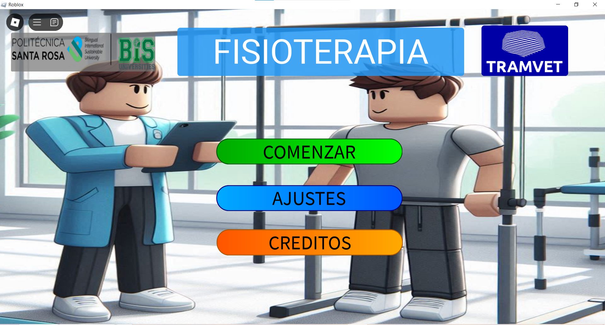

El menú está organizado dentro del contenedor ScreenGui, que incluye un Frame llamado Controles. Dentro de este, se encuentra el subframe Menu, que contiene todos los elementos del menú principal. A su vez, los botones están organizados en el contenedor BotonesMenu.

**Componentes de la Interfaz**

Los elementos que componen este menú son los siguientes:

- `Frame (Controles):` Marco principal que agrupa la interfaz gráfica inicial.
- `Menu:` Subcontenedor del menú principal.
- `BotonesMenu:` Contiene los tres botones interactivos.
- `Creditos:` Muestra los créditos del proyecto.
- `Tramvet, Fondo, LogoUPSRJ, Titulo:` Elementos visuales e institucionales.

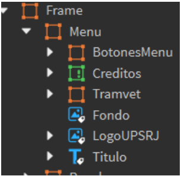

### Funcionalidad del Botón “Comenzar”

El botón “Start” es el encargado de dar inicio a la experiencia educativa. Al ser presionado, se reproduce un sonido de clic, se oculta el menú principal y se activa la visualización del entorno interactivo y educativo. Además, desde este punto se activan internamente otros elementos necesarios para la navegación y visualización, como los controles del modelo y las interfaces microscópicas (ver sección siguiente).

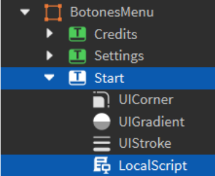

**Código del Script asociado a “Start”**

```Lua
local start = script.Parent
local player = game.Players.LocalPlayer
local pantalla = player:WaitForChild("PlayerGui"):WaitForChild("ScreenGui") 
local frame = pantalla:WaitForChild("Frame")
local sound = game.Workspace.Sounds:WaitForChild("ButtonClick1")
local textChangeEvent = game.ReplicatedStorage:WaitForChild("TextChangeEvent")

start.MouseButton1Click:Connect(function() 
    sound:Play()
    wait(0.09) 
    frame.Menu.Visible = false 
    wait(0.1)
    frame.Frame.ButtonAjustes.Visible = true
end)
```
**Explicación del código**

|Código|Descripción|
|-|-|
|local start = script.Parent|Asigna a la variable start el botón donde está insertado el script (Parent del script).|
|local player = game.Players.LocalPlayer|Obtiene al jugador que está usando el juego actualmente (jugador local).|
|local pantalla = player:WaitForChild("PlayerGui"):WaitForChild("ScreenGui")|Busca dentro del GUI del jugador el contenedor ScreenGui, donde se encuentran todos los elementos gráficos del menú.|
|local frame = pantalla:WaitForChild("Frame")|Accede al objeto Frame, que contiene los submenús, botones y pantallas adicionales.|
|local sound = game.Workspace.Sounds:WaitForChild("ButtonClick1")|Busca el sonido ButtonClick1 en la carpeta Sounds del Workspace para reproducirlo al hacer clic.|
|local textChangeEvent = game.ReplicatedStorage:WaitForChild("TextChangeEvent")|Accede a un evento remoto, posiblemente para futuras interacciones de contenido textual (no usado directamente aquí).|

Estas líneas son fundamentales, ya que permiten a todos los scripts trabajar sobre la misma base estructural, garantizando consistencia y en la forma local para cada jugador en que se manipulan los elementos gráficos e interactivos de la experiencia sin que interfieran con los otros jugadores.

```Lua
local start = script.Parent -- Hace referencia al objeto donde esta colocado el script 
local player = game.Players.LocalPlayer -- Obtener el jugador local 
local pantalla = player:WaitForChild("PlayerGui"):WaitForChild("ScreenGui") -- Accede a la instancia de PlayerGui y ScreenGui del jugador
local frame = pantalla:WaitForChild("Frame") --Accede al frame de pantalla del jugador 
```

**Función de interacción:**

```Lua
start.MouseButton1Click:Connect(function() 
    sound:Play()
    wait(0.09) 
    frame.Menu.Visible = false 
    wait(0.1)
    frame.Frame.ButtonAjustes.Visible = true
end)
```

|Línea|Acción|
|-|-|
|MouseButton1Click:Connect(...)|Activa una función cuando se hace clic izquierdo sobre el botón.|
|sound:Play()|Reproduce el sonido de clic.|
|wait(0.09)|Espera 0.09 segundos para que el sonido sea perceptible.|
|frame.Menu.Visible = false|Oculta el menú principal.|
|wait(0.1)|Espera un momento antes de mostrar los nuevos elementos.|
|frame.Frame.ButtonAjustes.Visible = true|Muestra el botón de ajustes en la nueva interfaz (verificar que frame.Frame esté correctamente referenciado en la jerarquía).|

### Funcionalidad de los Botones “Ajustes” y “Créditos”

Ambos botones están programados para ocultar el submenú de botones principales (BotonesMenu) y mostrar su sección respectiva (Ajustes o Creditos). Esto permite una navegación fluida sin cargar nuevas pantallas, conservando la experiencia dentro de un mismo Frame.

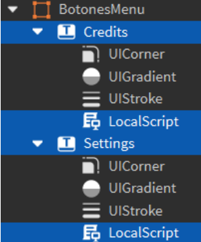

**Componentes de Interfaz de Usuario (UI) en los Botones del Menú**

|Componente|Tipo|Función principal|
|-|-|-|
|UICorner|Estético|Redondea las esquinas del botón, proporcionando una apariencia moderna y suave. El valor de su propiedad CornerRadius puede ajustarse para definir el grado de curvatura.|
|UIGradient|Estético|Aplica un degradado de color sobre el botón. Permite generar transiciones visuales suaves entre dos o más colores, mejorando el atractivo visual.|
|UIStroke|Estético|Agrega un contorno al borde del botón. Es útil para mejorar la legibilidad del texto y destacar el botón sobre otros elementos del fondo.|
|LocalScript|Funcional|Controla el comportamiento del botón al ser presionado. En este caso, ejecuta acciones específicas como ocultar y mostrar menús, reproducir sonidos o cambiar de vista.|

**Código del botón “Settings” (Ajustes)**

```Lua
local start = script.Parent
local player = game.Players.LocalPlayer
local pantalla = player:WaitForChild("PlayerGui"):WaitForChild("ScreenGui") local frame = pantalla:WaitForChild("Frame")
local sound = game.Workspace.Sounds:WaitForChild("ButtonClick1")

start.MouseButton1Click:Connect(function() 
    sound:Play()
    wait(0.09) 
    frame.Menu.BotonesMenu.Visible = false 
    wait(0.09)
    frame.Menu.Ajustes.Visible = true
end)

```

**Código del botón “Credits” (Créditos)**

```Lua
local start = script.Parent
local player = game.Players.LocalPlayer
local pantalla = player:WaitForChild("PlayerGui"):WaitForChild("ScreenGui") local frame = pantalla:WaitForChild("Frame")
local sound = game.Workspace.Sounds:WaitForChild("ButtonClick1")

start.MouseButton1Click:Connect(function() 
    sound:Play()
    wait(0.09) 
    frame.Menu.BotonesMenu.Visible = false 
    wait(0.09) 
    frame.Menu.Creditos.Visible = true
end)

```

**Lógica del evento:**

|Línea de código|Explicación|
|-|-|
|start.MouseButton1Click:Connect(function()|Esta línea se conecta al evento MouseButton1Click, que se activa cuando el jugador hace clic izquierdo sobre el botón start (en este caso, el botón de créditos).|
|sound:Play()|Reproduce un sonido previamente cargado (usualmente un clic), lo que proporciona retroalimentación auditiva al usuario.|
|wait(0.09)|Detiene la ejecución del script por 0.09 segundos.|
|frame.Menu.BotonesMenu.Visible = false|Esta línea oculta el contenedor principal de botones del menú. El cambio de la propiedad Visible a false hace que el grupo de botones desaparezca de la pantalla.|
|frame.Menu.Creditos.Visible = true|Finalmente, esta instrucción muestra la sección de créditos dentro del menú. Cambiar la propiedad Visible a true hace que este nuevo panel se muestre al usuario.|

## ¿Qué es un ProximityPrompt?

En el entorno de desarrollo de Roblox, un ProximityPrompt es una interfaz interactiva que permite a los jugadores ejecutar una acción específica al aproximarse a un objeto determinado dentro del espacio virtual. Esta herramienta facilita la creación de experiencias inmersivas sin requerir interfaces gráficas complejas, ya que ofrece interacciones contextuales intuitivas visibles directamente sobre los objetos del entorno tridimensional. Para este proyecto, se utilizó un ProximityPrompt con el objetivo de teletransportar al jugador a una ubicación específica dentro del escenario, simulando un sistema de navegación educativa por secciones anatómicas.

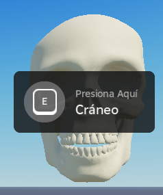

**Pasos para Crear y Configurar un ProximityPrompt**

1. **Selección de la Parte Interactiva:**
    Se identificó la parte llamada Head, contenida dentro del modelo ModelCraneo, como el objeto al que el usuario debe acercarse para activar la interacción. Esta parte representa una sección anatómica clave dentro del modelo tridimensional general del entorno de aprendizaje.


2. **Inserción del ProximityPrompt:**
    Una vez seleccionada la parte Head, se realizó el siguiente procedimiento para insertar el ProximityPrompt:
    - Hacer clic derecho sobre la parte y seleccionar la opción "Insertar Objeto".
    - Elegir la opción ProximityPrompt del menú contextual

    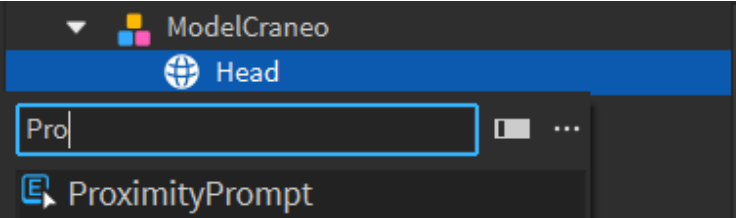

3. **Configuración del ProximityPrompt:**
    Con el ProximityPrompt insertado, se accedió a sus propiedades mediante la ventana Properties de Roblox Studio. Se personalizaron los siguientes parámetros:
    - `ActionText:` define el texto que se mostrará al jugador, como “Ir a sección”.
    - `ObjectText:` una descripción breve del objeto.
    - `HoldDuration:` define cuánto tiempo debe mantenerse activada la acción para ejecutarse.

    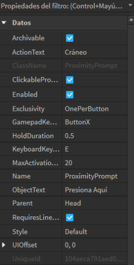

    Esta configuración garantiza que el prompt sea visible, claro y funcional, incluso en dispositivos con pantallas reducidas, como móviles.

4. :**Inserción del Script para Teletransportación:**

    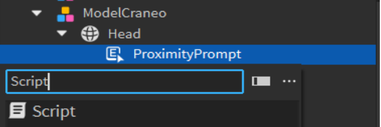 

    Finalmente, se agregó un Script dentro de la misma parte (Head) que contiene el ProximityPrompt. Este script controla la acción que se ejecuta cuando el jugador activa la interacción, en este caso, una teletransportación hacia una coordenada específica del entorno virtual, situada justo sobre la parte llamada HeadBase.

    A continuación, se muestra el fragmento de código utilizado para esta funcionalidad:

    ```Lua
    local proximityprompt = script.Parent -- Referencia al ProximityPrompt
    local localscript = game.StarterPlayer -- Referencia al StarterPlayer
    local player = game.Players.LocalPlayer -- Obtener el jugador local

    proximityprompt.Triggered:Connect(function(player) -- Teletransportar al jugador al bloque llamado HeadBase cuando se activa el ProximityPrompt
    
        player.Character.HumanoidRootPart.Position = workspace.HeadBase.Position + Vector3.new(0, 5, 0)
    end)
    ```

## Manipulación Avanzada de la Cámara con Scripts

Explicación del Código de Manipulación de Cámara con ProximityPrompt
Uno de los elementos clave para lograr una experiencia educativa inmersiva en Roblox es el control de la cámara del jugador. En este caso, se implementó un script que cambia la posición y orientación de la cámara cuando el jugador activa un ProximityPrompt, permitiéndole observar una parte específica del modelo tridimensional (por ejemplo, el cráneo). Además del cambio de cámara,el script también muestra controles interactivos en la interfaz gráfica (GUI) que permiten al usuario realizar acciones como hacer zoom o avanzar.

Este script se colocó dentro de la carpeta StarterPlayerScripts, en un archivo de tipo LocalScript llamado LocalScriptCraneo, ya que necesita ejecutarse desde el cliente para controlar la cámara del jugador local.

**Código del Script Local**

```Lua
local tweenService = game:GetService("TweenService") 
local part = game.Workspace:WaitForChild("Cam1") 
local cam = game.Workspace.Camera
local proximityprompt = game.Workspace.ModelCraneo.Head.ProximityPrompt

local player = game.Players.LocalPlayer
local playerGui = player:WaitForChild("PlayerGui") -- Accede a la instancia de PlayerGui del jugador
local frame = playerGui:WaitForChild("ScreenGui"):WaitForChild("Frame") -- Obtén el Frame desde PlayerGui

proximityprompt.Triggered:Connect(function() 
    cam.CameraType = Enum.CameraType.Scriptable
    cam.CFrame = CFrame.lookAt(part.Position, game.Workspace.Cam0.Position) 
    frame.Controles.Visible = true
    frame.Controles.Zoom.Visible = true 
    frame.Controles.Back.Visible = false
end)
```
A continuación, se explica el funcionamiento de cada línea del script:

**Inicialización de Servicios y Objetos**

|Código|Explicación|
|-|-|
|local tweenService = game:GetService("TweenService")|Obtiene el servicio TweenService, que permite crear animaciones suaves. Aunque en este caso no se usa directamente, está preparado para futuras animaciones.|
|local part = game.Workspace:WaitForChild("Cam1")|Obtiene una referencia a un objeto llamado Cam1, que es la nueva posición desde donde se colocará la cámara.|
|local cam = game.Workspace.Camera|Accede a la cámara principal del juego.|
|local proximityprompt = game.Workspace.ModelCraneo.Head.ProximityPrompt|Obtiene el ProximityPrompt ubicado en la parte Head del modelo ModelCraneo.|

**Acceso al Jugador y su Interfaz**

|Código|Explicación|
|-|-|
|local player = game.Players.LocalPlayer|Obtiene al jugador local, es decir, quien está usando el juego.|
|local playerGui = player:WaitForChild("PlayerGui")|Accede a la interfaz gráfica (GUI) de ese jugador.|
|local frame = playerGui:WaitForChild("ScreenGui"):WaitForChild("Frame")|Encuentra el Frame (contenedor visual) donde están los botones de control.|

**Activación del ProximityPrompt**

|Código|Explicación|
|-|-|
|proximityprompt.Triggered:Connect(function()|Inicia una función cuando el jugador activa el ProximityPrompt (por ejemplo, al acercarse al modelo).|

**Cambio de la Cámara**

|Código|Explicación|
|-|-|
|cam.CameraType = Enum.CameraType.Scriptable|Cambia la cámara a modo Scriptable, lo que permite controlarla completamente desde código.|
|cam.CFrame = CFrame.lookAt(part.Position, game.Workspace.Cam0.Position)|Reubica la cámara en la posición de Cam1, y la orienta para que mire hacia Cam0, simulando una toma fija sobre una zona anatómica específica.|

**Visualización de Controles en la GUI**

|Código|Explicación|
|-|-|
|frame.Controles.Visible = true|Muestra los controles interactivos en pantalla.|
|frame.Controles.Zoom.Visible = true|Activa específicamente el botón de Zoom.|
|frame.Controles.Back.Visible = false|Oculta el botón de Regresar, posiblemente porque en este punto no se necesita.|

Este script permite guiar al usuario a través de un enfoque visual controlado y específico, ideal para explicar partes anatómicas desde ángulos estratégicos. El uso de ProximityPrompt en conjunto con el manejo de cámara y GUI, refuerza la experiencia inmersiva y mejora la comprensión de conceptos espaciales y estructurales.

## Creación de Interfaz Gráfica (GUI) y Botones Interactivos Botón “Exit” y Restauración de Modelos

Dentro del entorno educativo desarrollado en Roblox, se implementó un botón interactivo denominado “Exit”, que permite al jugador abandonar la vista enfocada sobre un modelo anatómico específico (como el cráneo) y regresar a una posición general del escenario. Además, este botón restaura la cámara a su estado predeterminado, oculta los controles visuales y reubica los modelos 3D modificados a sus posiciones originales, lo cual garantiza una experiencia coherente y limpia para el siguiente ciclo de interacción.

Este script se ubica dentro de un LocalScript, alojado en un TextButton llamado “Exit”, el cual está contenido en un Frame denominado “Controles”, dentro del ScreenGui correspondiente al jugador en la carpeta StarterGui.

**Estructura Jerárquica de la Interfaz**

- `StarterGui:` Carpeta principal donde se alojan las interfaces gráficas visibles para el jugador.
- `ScreenGui:` Contenedor principal de la interfaz.
- `Frame (Controles):` Marco que agrupa los botones funcionales.
- `TextButton ("Exit"):` Botón que ejecuta el script para salir de la vista del modelo.

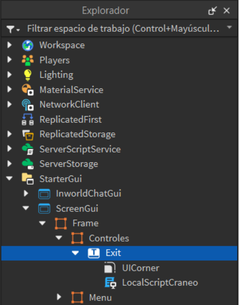

Elementos visuales adicionales como UICorner permiten redondear las esquinas del botón para mejorar su apariencia, mientras que el LocalScript (Craneo) se encarga de la lógica funcional.

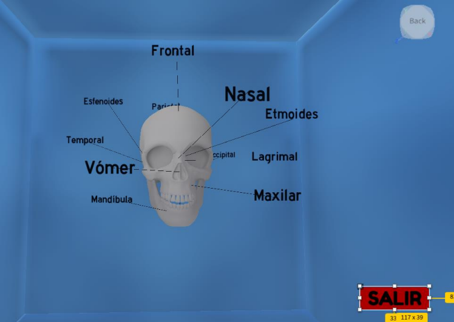

**Descripción General del Funcionamiento**

El script ejecutado al presionar el botón “Exit” realiza las siguientes acciones:

- Teletransporta al jugador a una posición específica del escenario llamada ExitCraneo.
- Restaura el tipo de cámara al modo predeterminado, devolviendo el control visual al jugador.
- Oculta los controles gráficos (GUI) relacionados con la exploración del modelo.
- Restaura las posiciones originales de modelos 3D, revirtiendo cualquier movimiento o animación realizada durante la interacción.

**Código del Script Local**

```Lua
local exit = game.Workspace:WaitForChild("ExitCraneo") 
local cam = game.Workspace.Camera
local player = game.Players.LocalPlayer 
local humanoid = player.Character
local humanoidRootPart = humanoid:WaitForChild("HumanoidRootPart") 
local playerGui = player:WaitForChild("PlayerGui")
local frame = playerGui:WaitForChild("ScreenGui"):WaitForChild("Frame")

local initialCFrames = {}
local heads = { workspace.Head1, workspace.Head2, workspace.Head3 } -- Ejemplo de partes a restaurar

-- Guardar posiciones originales 
for i, head in pairs(heads) do
    initialCFrames[i] = head.CFrame
end

-- Evento al hacer clic en el botón "Exit" 
script.Parent.MouseButton1Click:Connect(function()
    humanoidRootPart.CFrame = CFrame.new(exit.Position) + Vector3.new(0, 5, 0) 
    cam.CameraType = Enum.CameraType.Custom
    frame.Controles.Visible = false

-- Restaurar posiciones originales 
    for i, head in pairs(heads) do
        head.CFrame = initialCFrames[i]
    end 
end)

```

**Definición de Variables y Referencias**

|Código|Explicación|
|-|-|
|local exit = game.Workspace:WaitForChild("ExitCraneo")|Obtiene el punto de destino al que será teletransportado el jugador.|
|local cam = game.Workspace.Camera|Accede a la cámara del juego para modificar su modo.|
|local player = game.Players.LocalPlayer|Obtiene al jugador local que ejecuta el script.|
|local humanoid = player.Character|Referencia al personaje del jugador.|
|local humanoidRootPart = humanoid:WaitForChild("HumanoidRootPart")|Parte del personaje usada para el teletransporte.|
|local playerGui = player:WaitForChild("PlayerGui")|Interfaz gráfica del jugador.|
|local frame = playerGui:WaitForChild("ScreenGui"):WaitForChild("Frame")|Frame que contiene los controles del GUI.|
|local initialCFrames = {}|Crea una tabla para guardar las posiciones originales de los modelos.|
|local heads = { ... }|Lista de partes del modelo que se van a restaurar.|

**Funcionalidad del Botón “Exit”**

|Código|Explicación|
|-|-|
|script.Parent.MouseButton1Click:Connect(function()|Activa una función cuando el jugador hace clic en el botón “Exit”.|
|humanoidRootPart.CFrame = CFrame.new(exit.Position) + Vector3.new(0, 5, 0)|Teletransporta al jugador a la ubicación deseada, con un ajuste vertical.|
|cam.CameraType = Enum.CameraType.Custom|Restaura el control manual de la cámara al jugador.|
|frame.Controles.Visible = false|Oculta el panel de controles en la interfaz.|
|for i, head in pairs(heads) do ... end|Recorre la lista de modelos y los devuelve a sus posiciones originales.|

Este botón resulta esencial para mantener la coherencia y fluidez de la experiencia de usuario, permitiendo salir de una vista específica de manera controlada y restaurando el entorno para futuras interacciones educativas.


## Controles Interactivos de Modelos 3D

**Organización y Funcionalidad de los Controles**

Dentro de la interfaz gráfica desarrollada en Roblox, se incorporó un conjunto de botones interactivos que permiten al usuario rotar y explorar modelos 3D desde distintos ángulos, facilitando la comprensión espacial de estructuras anatómicas como el cráneo. Estos botones están organizados en un Frame denominado Controles, contenido dentro de la interfaz principal ubicada en la carpeta StarterGui.

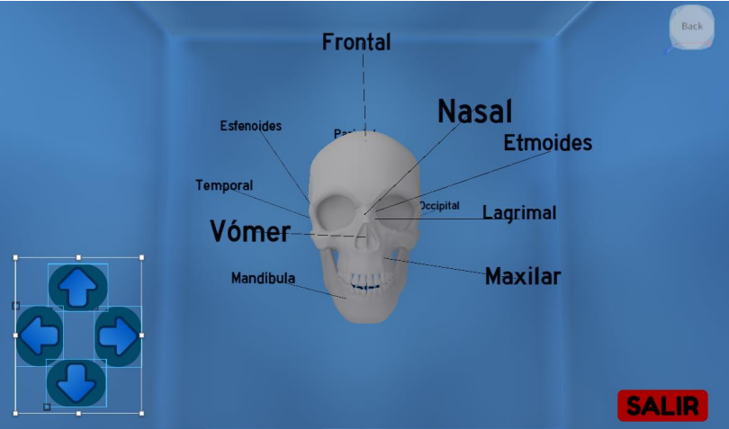

Cada botón está asociado a una dirección específica: Right (Derecha), Left (Izquierda), Top (Arriba), Bottom (Abajo), y se encarga de ejecutar una rotación suave del modelo según el eje correspondiente. El diseño busca una navegación intuitiva que ayude al estudiante a examinar el modelo desde múltiples perspectivas.

**Estructura Jerárquica de los Elementos GUI**

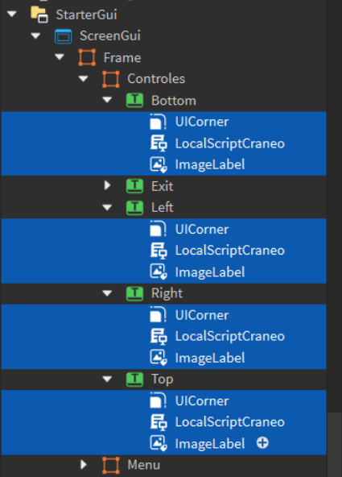

- `ScreenGui:` Contenedor principal de la interfaz del jugador.
- `Frame (Controles):` Agrupa los botones funcionales de rotación.
- `TextButton ("Right"):` Gira el modelo hacia la derecha.
- `TextButton ("Left"):` Gira el modelo hacia la izquierda.
- `TextButton ("Top"):` Gira el modelo hacia arriba.
- `TextButton ("Bottom"):` Gira el modelo hacia abajo.
- `ImageLabel:` Elemento visual decorativo dentro de la interfaz.
- `UICorner:` Estiliza los botones redondeando sus esquinas.
- `LocalScript:` Script que controla la rotación del modelo.

**Código del Script Local (Ejemplo: Botón “Top”)**

```Lua
local player = game.Players.LocalPlayer
local character = player.Character or player.CharacterAdded:Wait() 
local head = game.Workspace:WaitForChild("Head")
local runService = game:GetService("RunService")

local UserInputService = game:GetService("UserInputService") 

local isHolding = false

local function printRepeatedly() 
    while isHolding do
        head.CFrame = head.CFrame * CFrame.Angles(math.rad(2), 0, 0) 
        wait()
    end
end

-- Inicia la rotación cuando se mantiene presionado el botón 
script.Parent.MouseButton1Down:Connect(function()
    isHolding = true 
    printRepeatedly()
end)

-- Detiene la rotación cuando se suelta el botón 
script.Parent.MouseButton1Up:Connect(function()
    isHolding = false 
end)

-- También detiene la rotación si el cursor sale del botón 
script.Parent.MouseLeave:Connect(function()
    isHolding = false 
end)

-- Reinicia la rotación si el cursor vuelve al botón mientras está presionado 
script.Parent.MouseEnter:Connect(function() 
    if isHolding then
        printRepeatedly()
    end 
end)
```

**Explicación del Código**
|Código|Explicación|
|-|-|
|local player = game.Players.LocalPlayer|Obtiene al jugador actual.|
|local character = player.Character or player.CharacterAdded:Wait()|Espera a que el personaje esté disponible.|
|local head = game.Workspace:WaitForChild("Head")|Obtiene el modelo a rotar (por ejemplo, el cráneo).|
|local isHolding = false|Variable booleana que detecta si el botón está presionado.|
|rotateHeadUp()|Función que ejecuta la rotación mientras el botón está siendo presionado.|

**Detalle de la función rotateHeadUp**

```Lua
local function printRepeatedly() 
    while isHolding do
        head.CFrame = head.CFrame * CFrame.Angles(math.rad(2), 0, 0) 
        wait()
    end
end
```
Esta función realiza una rotación continua del modelo en el eje X, mientras el usuario mantiene presionado el botón. La rotación se aplica de manera incremental mediante `CFrame.Angles`, que utiliza radianes, por lo que `math.rad(2`) representa una rotación de 2 grados por ciclo. El uso de wait() permite que esta rotación ocurra de forma suave y controlada.

**Comportamiento de CFrame.Angles y sus Ejes**

La función CFrame.Angles(x, y, z) permite aplicar rotaciones sobre los siguientes ejes:

- `Eje X (arriba/abajo)` – Inclinación vertical.
- `Eje Y (izquierda/derecha)` – Rotación lateral.
- `Eje Z (inclinación lateral)` – Giro como si el modelo se volcara hacia los lados.

Se muestra cómo configurar los botones para que realicen rotaciones en diferentes direcciones:

|Botón|Rotación deseada|Código sugerido|
|-|-|-|
|`Top`|Gira el modelo hacia arriba (eje X positivo)|*CFrame.Angles(math.rad(2), 0, 0)*|
|`Bottom`|Gira el modelo hacia abajo (eje X negativo)|*CFrame.Angles(math.rad(-2), 0, 0)*|
|`Right`|Gira el modelo hacia la derecha (eje Y positivo)|*CFrame.Angles(0, math.rad(2), 0)*|
|`Left`|Gira el modelo hacia la izquierda (eje Y negativo)|*CFrame.Angles(0, math.rad(-2), 0)*|

Esta funcionalidad mejora significativamente la interacción del usuario con los modelos anatómicos, permitiéndole analizarlos de manera más detallada y desde distintas perspectivas. Su implementación es fundamental para lograr una experiencia educativa inmersiva y accesible desde múltiples dispositivos.

## Funcionalidades Complementarias: “Restaurar”, “Zoom” y “Back”

Además de los controles direccionales, se añadieron tres botones clave que complementan la interacción del usuario con el modelo anatómico: Restaurar, Zoom y Back. Estas funciones están integradas en el mismo Frame de controles y fueron desarrolladas mediante LocalScripts que modifican la cámara y el estado visual del entorno educativo.

**Estructura Jerárquica “Restaurar”, “Zoom” y “Back”:**

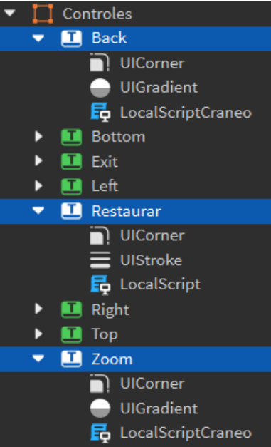

**Back**
- **UICorner:** redondea esquinas.
- **UIGradient:** aplica degradado.
- **LocalScriptCraneo:** mueve la cámara a su vista anterior.

**Restaurar**
- **UICorner:** redondea esquinas.
- **UIStroke:** trazo externo.
- **LocalScript:** restaura posición original del modelo.

**Zoom**
- **UICorner:** redondea esquinas.
- **UIGradient:** aplica degradado.
- **LocalScriptCraneo:** acerca la cámara a una zona específica.

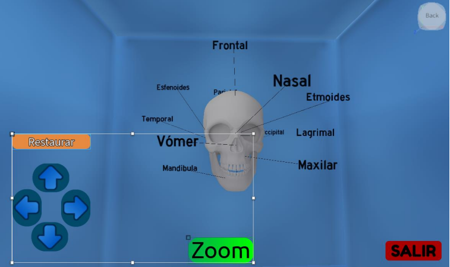

**Botón “Restaurar”**

El botón “Restaurar” permite al usuario revertir el modelo 3D a su posición original, útil después de haber rotado o desplazado el modelo manualmente. Este botón accede a una lista de objetos (por ejemplo, Head) y aplica nuevamente sus posiciones iniciales mediante el uso de CFrame.

**Código del Script Local**

```Lua
local initialCFrames = {} 
local modelos = {
game.Workspace:WaitForChild("Head"),
}

-- Almacena las posiciones originales 
for _, modelo in ipairs(modelos) do
    table.insert(initialCFrames, modelo.CFrame)
end

script.Parent.MouseButton1Click:Connect(function() 
    for i, modelo in ipairs(modelos) do
        modelo.CFrame = initialCFrames[i]
    end 
end)
```

**Explicación del Código**

|Código|Función|
|-|-|
|initialCFrames|Tabla que almacena las posiciones originales (CFrame) de los modelos.|
|modelos|Lista de objetos 3D que se desean restaurar.|
|Bucle for|Guarda las posiciones iniciales de los modelos.|
|Evento MouseButton1Click|Cuando se presiona el botón, se recorren los modelos y se les asigna su CFrame original.|

Esta función asegura que el estudiante siempre pueda reiniciar la exploración desde una vista limpia y ordenada.

**Botón “Zoom”**

El botón “Zoom” permite realizar un acercamiento animado hacia una parte específica del modelo utilizando el servicio TweenService, que genera una transición suave de cámara. En este caso, la cámara se mueve desde su posición actual hacia la parte Cam2, enfocándose en dirección a Cam3.

**Código del Script Local**

```Lua
local TweenService = game:GetService("TweenService") 
local part = game.Workspace:WaitForChild("Cam2") 
local cam = game.Workspace.CurrentCamera
local player = game.Players.LocalPlayer
local playerGui = player:WaitForChild("PlayerGui")
local frame = playerGui:WaitForChild("ScreenGui"):WaitForChild("Frame")

local informacion = TweenInfo.new( 
    2,
    Enum.EasingStyle.Sine, 
    Enum.EasingDirection.InOut, 
    0,
    false, 
    0
)

script.Parent.MouseButton1Click:Connect(function() 
    local targetCFrame = CFrame.lookAt(part.Position,
game.Workspace.Cam3.Position)
    local tween = TweenService:Create(cam, informacion, {CFrame = targetCFrame}) 
    frame.Controles.Visible = false 
    tween:Play()

    tween.Completed:Connect(function() 
        frame.Controles.Visible = true 
        frame.Controles.Zoom.Visible = false
        frame.Controles.Back.Visible = true
    end) 
end)
```

**Explicación del Código**

|Código|Función|
|-|-|
|TweenService|Servicio de Roblox que permite crear animaciones suaves.|
|Cam2, Cam3|Objetos usados como referencia para la posición y orientación de la cámara.|
|TweenInfo|Define la duración y estilo de la animación.|
|TweenService:Create|Crea una animación que mueve la cámara al nuevo CFrame.|
|Zoom.Visible = false, Back.Visible = true|Actualiza la interfaz para mostrar solo el botón "Back" después del zoom.|

Este sistema proporciona una forma amigable y estética de profundizar visualmente en el modelo.

**Botón “Back”**

La función del botón “Back” es revertir la cámara a su posición anterior luego del zoom, utilizando nuevamente TweenService. La cámara vuelve a posicionarse en Cam1, orientándose hacia Cam0, y se restauran los botones originales.

**Código del Script Local**

```Lua
local TweenService = game:GetService("TweenService")
local part = game.Workspace:WaitForChild("Cam1")
local cam = game.Workspace.CurrentCamera 
local player = game.Players.LocalPlayer
local playerGui = player:WaitForChild("PlayerGui")
local frame = playerGui:WaitForChild("ScreenGui"):WaitForChild("Frame")

local informacion = TweenInfo.new( 
    2,
    Enum.EasingStyle.Sine, 
    Enum.EasingDirection.InOut, 
    0,
    false, 
    0
)

script.Parent.MouseButton1Click:Connect(function() 
    local targetCFrame = CFrame.lookAt(part.Position,
game.Workspace.Cam0.Position)
    local tween = TweenService:Create(cam, informacion, {CFrame = targetCFrame})  
    frame.Controles.Visible = false
    tween:Play()

    tween.Completed:Connect(function() 
        frame.Controles.Visible = true 
        frame.Controles.Back.Visible = false 
        frame.Controles.Zoom.Visible = true
    end)
end)
```

**Explicación del Código**

|Código|Función|
|-|-|
|Cam1, Cam0|Referencias para reposicionar la cámara a su estado anterior.|
|TweenService|Ejecuta una animación suave para evitar transiciones bruscas.|
|Back.Visible = false, Zoom.Visible = true|Restaura la visualización de botones al estado anterior.|

Esta funcionalidad mejora la navegación fluida del entorno educativo, permitiendo al usuario acercarse y luego retroceder sin perder orientación.

Estas herramientas gráficas y de navegación son fundamentales para mantener una experiencia interactiva coherente, reforzando el aprendizaje visual mediante movimientos naturales, accesibles y personalizables por parte del estudiante.


## Controles Interactivos de Información de las Partes Microscópicas Propósito educativo

El sistema de controles interactivos para información microscópica fue diseñado con el objetivo de permitir al estudiante explorar a detalle las partes internas de un hueso largo, como la médula ósea, el periostio, las arterias nutricias, entre otras. A través de la interacción con zonas activas del modelo, se despliega información textual y visual directamente sobre la pantalla, guiando el aprendizaje del usuario de forma intuitiva y visualmente enriquecida.

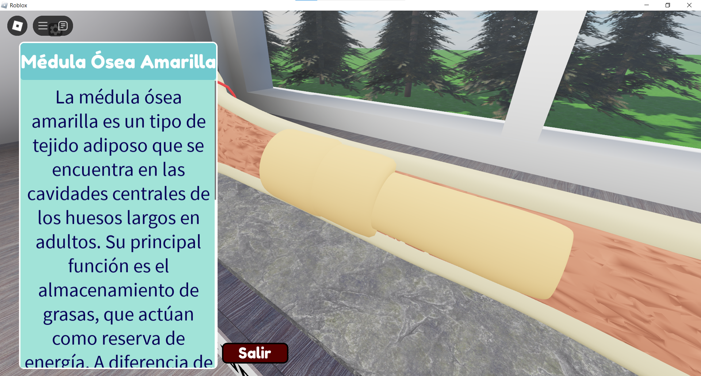

Este sistema se activa desde el botón "Comenzar" del menú principal. Al hacer clic en este botón, se ejecuta un script que dispara una serie de eventos remotos mediante el objeto TextChangeEvent. Estos eventos contienen claves de texto (título y descripción) vinculadas a cada una de las partes microscópicas del modelo óseo y se relacionan directamente con los paneles Panel_info en la interfaz de usuario. Esta acción inicial asegura que toda la información educativa esté pre-cargada y correctamente enlazada a los elementos visuales correspondientes, para mostrarse automáticamente cuando el usuario interactúe con un punto del modelo.

**Activación del sistema desde el botón "Comenzar"**

El siguiente script está vinculado al botón "Start" y tiene como función inicializar el entorno y preparar la información textual para cada estructura:

```Lua
textChangeEvent:Fire("titulo_medula_amarilla", "Médula Ósea Amarilla")
textChangeEvent:Fire("descripcion_medula_amarilla", "La médula ósea amarilla es un tipo de tejido adiposo...") 
```

|Línea|Explicación|
|-|-|
|textChangeEvent:Fire(...)|Envía un evento remoto que contiene una clave de identificación (título o descripción) y el texto que debe mostrarse posteriormente.|
|Claves como "titulo_medula_amarilla"|Actúan como identificadores que permiten a otros scripts saber cuál texto cargar en cada caso.|

**Estructura de la interfaz informativa**

Los paneles informativos están ubicados dentro de *ScreenGui > Frame > Paneles > Panel_info1 (o similares)*. Cada panel contiene:
- **Titulos:** un TextLabel que muestra el nombre de la estructura
- **ScrollingFrame:** contiene el texto explicativo completo dentro de Texto.Text
- **Salir:** un botón para cerrar el panel

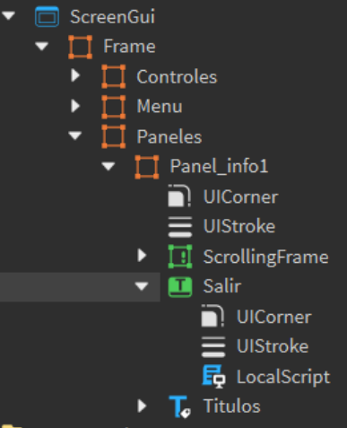

**Script que escucha el evento y muestra la información**

```Lua
textChangeEvent.Event:Connect(function(Title, Description) 
    if Title == "titulo_medula_amarilla" then
        frame.Titulos.Text = Description
    elseif Title == "descripcion_medula_amarilla" then 
        frame.ScrollingFrame.Texto.Text = Description
    end
end)
```

|Línea|Explicación|
|-|-|
|textChangeEvent.Event:Connect(...)|Escucha el evento enviado desde el botón "Start" para recibir el título o descripción y mostrarlos.|
|if Title == "titulo_medula_amarilla"|Verifica si el evento recibido corresponde al título de esa sección.|
|frame.Titulos.Text = Description|Asigna el texto recibido al campo del título en el panel GUI.|
|ScrollingFrame.Texto.Text = Description|Inserta el contenido descriptivo largo dentro del panel desplazable.|

**Activación del ProximityPrompt y animación de cámara**

```Lua
ProximityPrompt.Triggered:Connect(function() 
    cam.CameraType = Enum.CameraType.Scriptable
    local targetCFrame = CFrame.lookAt(part.Position, CamaraHuesoCompacto.Position)
    local tween = TweenService:Create(cam, informacion, {CFrame = targetCFrame})
    tween:Play()
```

|Línea|Explicación|
|-|-|
|ProximityPrompt.Triggered:Connect(...)|Inicia la función cuando el jugador se acerca e interactúa con la zona activa.|
|cam.CameraType = Enum.CameraType.Scriptable|Permite que la cámara sea controlada por script.|
|CFrame.lookAt(...)|Define hacia dónde mirará la cámara.|
|TweenService:Create(...)|Crea una animación suave para mover la cámara hacia la nueva posición.|

**Animación de aparición del panel informativo**

```Lua
frame.Visible = true
frame.Position = UDim2.new(0.031, 0, -0.93, 0)
frame:TweenPosition(UDim2.new(0.031, 0, 0.02, 0), ...)
```

|Línea|Explicación|
|-|-|
|frame.Visible = true|Hace visible el panel en la pantalla.|
|frame.Position = ...|Define una posición inicial fuera de la pantalla.|
|TweenPosition(...)|Anima la transición del panel desde fuera hasta su posición visible.|

**Cierre del panel mediante el botón "Salir"**

```Lua
botonCerrar.MouseButton1Click:Connect(function() 
    frame:TweenPosition(UDim2.new(0.031, 0, -0.93, 0), ...) 
    frame.Visible = false
    cam.CameraType = Enum.CameraType.Custom
end)
```
|Línea|Explicación|
|-|-|
|MouseButton1Click:Connect(...)|Escucha el clic sobre el botón "Salir".|
|TweenPosition(...)|Mueve el panel nuevamente hacia arriba para ocultarlo.|
|frame.Visible = false|Oculta el panel por completo.|
|CameraType = Custom|Devuelve el control de la cámara al jugador.|
Este sistema combina elementos de interacción espacial con visualización textual, animaciones y eventos sincronizados para lograr una experiencia inmersiva de aprendizaje. El uso de *ProximityPrompt*, *TweenService* y *RemoteEvents* permite mantener la estructura modular, escalable y fácil de mantener, ofreciendo al estudiante una herramienta didáctica centrada en la exploración y comprensión de estructuras microscópicas óseas.

## Animación de Lenguaje de Señas con Activación por Contacto

Como parte de la experiencia educativa e inclusiva del entorno, se integró un NPC con animación en lenguaje de señas, cuyo objetivo es dar la bienvenida al jugador utilizando una representación visual accesible. Esta animación representa el saludo inicial en lenguaje de señas mexicano, lo cual enriquece la experiencia para usuarios con distintas necesidades de comunicación y refuerza el componente humano del aprendizaje.

**Activación mediante detección de contacto**

La animación se activa al entrar en contacto con un bloque invisible colocado frente al NPC. Este sistema utiliza eventos físicos del entorno (Touched y TouchEnded) para detectar cuándo el jugador se acerca o se aleja del área de activación. El enfoque permite un comportamiento automático y natural, sin necesidad de botones ni interfaces adicionales.

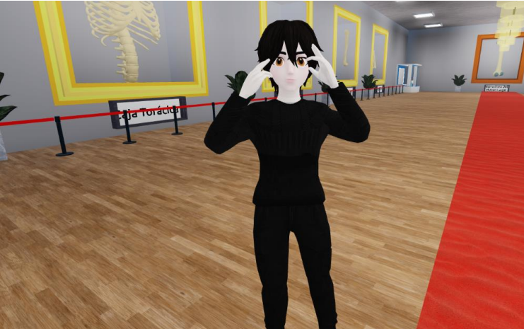

**Estructura del Script**

```Lua
local animation = script:WaitForChild("Animation")
local humanoid = script.Parent:WaitForChild("AnimationController") 
local welcome = humanoid:LoadAnimation(animation)
local welcomeBlock = game.workspace:WaitForChild("welcome")
```

|Línea|Descripción|
|-|-|
|WaitForChild("Animation")|Accede al recurso de animación cargado previamente dentro del script.|
|AnimationController|Controlador que permite ejecutar animaciones sobre un modelo que no es un jugador.|
|LoadAnimation(animation)|Carga la animación en el controlador.|
|welcomeBlock|Hace referencia al objeto del entorno que funcionará como zona de activación.|

**Detección de entrada y salida del área de activación**

```Lua
local function onTouched(hit)
local character = hit.Parent
if character and character:FindFirstChild("Humanoid") then 
    welcome:Play()
    welcome.Looped = true
    end
end
```

|Línea|Explicación|
|-|-|
|onTouched|Función que se ejecuta cuando un objeto toca el bloque activador.|
|FindFirstChild("Humanoid")|Verifica que el objeto que entró sea un personaje.|
|welcome:Play()|Inicia la animación del NPC.|
|welcome.Looped = true|Configura la animación para que se repita mientras el jugador esté cerca.|

```Lua
local function onTouchEnded(hit) 
local character = hit.Parent
if character and character:FindFirstChild("Humanoid") then 
        welcome:Stop()
    end
end
```

|Línea|Explicación|
|-|-|
|onTouchEnded|Función que se ejecuta cuando el jugador se aleja del bloque.|
|welcome:Stop()|Detiene la animación. Esto evita que el NPC continúe gesticulando cuando no hay jugadores cerca.|

**Conexión de eventos**

```Lua
welcomeBlock.Touched:Connect(onTouched)
welcomeBlock.TouchEnded:Connect(onTouchEnded)
```

Estas dos líneas vinculan las funciones a los eventos físicos del objeto welcome, activando o deteniendo la animación en función del movimiento del jugador.

Dado que el NPC no está asociado a un Humanoid completo (como el de un jugador), se utiliza un AnimationController, lo cual es fundamental para reproducir animaciones en modelos independientes. Esta decisión técnica permite controlar al NPC con flexibilidad sin necesidad de crear una estructura de personaje completa.

Esta implementación añade un componente visual accesible e inclusivo, ideal para captar la atención del usuario al iniciar la simulación. También representa un paso hacia la adaptación de recursos educativos digitales a entornos más diversos y empáticos.
