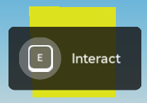
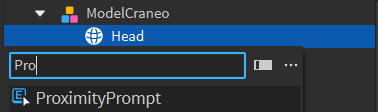
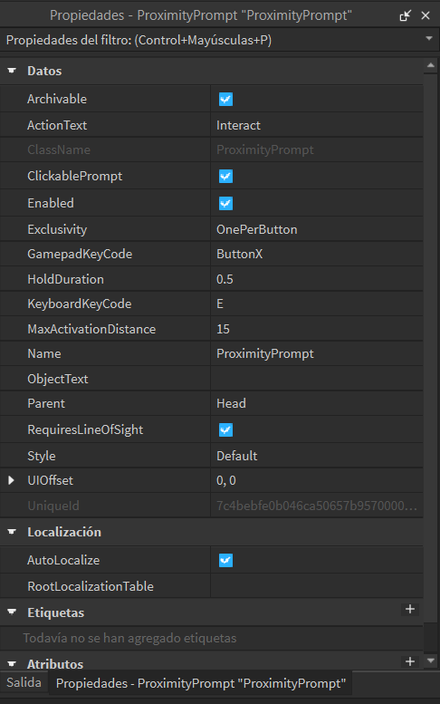
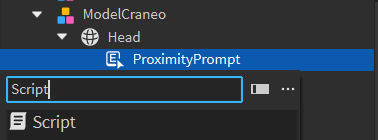

# Desarrollo de Scripts

## Crear un ProximityPrompt para Teletransportar al Jugador

### ¿Qué es un ProximityPrompt?

Un `ProximityPrompt` es una interfaz interactiva en Roblox que permite a los jugadores activar acciones al acercarse a un objeto. En este ejemplo, configuraremos un `ProximityPrompt` para teletransportar al jugador a una ubicación específica cuando se active. [Mas Informacion](https://create.roblox.com/docs/es-es/reference/engine/classes/ProximityPrompt)



### Pasos para Crear y Configurar un ProximityPrompt

1. **Crear la Parte**: Localiza el modelo llamado `Head` dentro de `ModelCraneo`. Esta parte será el objeto al que el jugador deberá acercarse para activar el `ProximityPrompt`.

2. **Añadir el ProximityPrompt**:
    - Selecciona la parte llamada `Head` dentro del `ModelCraneo`.
    - Haz clic derecho en la parte y selecciona `Insertar Objeto`.
    - Escoge `ProximityPrompt` del menú.

    

3. **Configurar el ProximityPrompt**:
    - Selecciona el `ProximityPrompt` que añadiste a la parte.
    - En la ventana de `Propiedades`, ajusta las configuraciones como `ActionText` (el texto que se mostrará), `ObjectText`, `HoldDuration`, entre otros.

    

4. **Añadir el Script**:
    - Añade un `Script` a la misma parte que contiene el `ProximityPrompt`.

    

```lua
local proximityprompt = script.Parent -- Referencia al ProximityPrompt
local localscript = game.StarterPlayer -- Referencia al StarterPlayer
local player = game.Players.LocalPlayer -- Obtener el jugador local

proximityprompt.Triggered:Connect(function(player)
    -- Teletransportar al jugador al bloque llamado HeadBase cuando se activa el ProximityPrompt
    player.Character.HumanoidRootPart.Position = workspace.HeadBase.Position + Vector3.new(0, 5, 0)
end)
```

## Crear un Boton y Explicación del Código para Regresar a la Base

En este ejemplo, se ha configurado una interfaz de usuario (GUI) en `StarterGui` que incluye un botón para teletransportar al jugador a una posición específica en el juego (una base de regreso). A continuación, se explica cada parte del código y la estructura de la GUI utilizada.

## Estructura de la GUI

### Carpeta StarterGui:
- **ScreenGui**: Un contenedor de elementos GUI que aparece en la pantalla del jugador.
- **Frame**: Un marco dentro del `ScreenGui` que contiene otros elementos GUI.
- **Frame "Controles"**: Un marco adicional dentro del `Frame` principal.
- **TextButton "Exit"**: Un botón de texto dentro del `Frame` principal.
- **UICorner**: Un elemento que redondea las esquinas del `TextButton`.
- **LocalScript**: Un script local que maneja la funcionalidad del botón.


## Código del Script Local

```lua
local exit = game.Workspace:WaitForChild("ExitCraneo")
local player = game.Players.LocalPlayer
local humanoid = player.Character
local humanoidRootPart = humanoid:WaitForChild("HumanoidRootPart")
local playerGui = player:WaitForChild("PlayerGui") 
local frame = playerGui:WaitForChild("ScreenGui"):WaitForChild("Frame")

script.Parent.MouseButton1Click:Connect(function()
    humanoidRootPart.CFrame = CFrame.new(exit.Position) + Vector3.new(0, 5, 0)
    frame.Controles.Visible = false
end)

