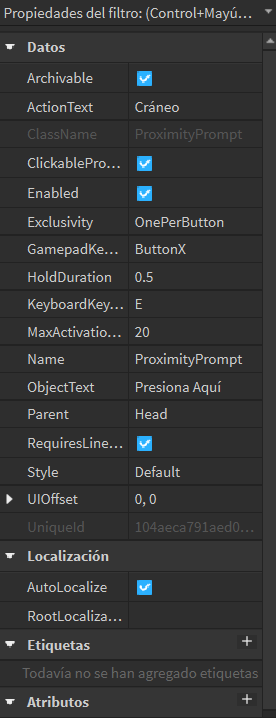

# Desarrollo de Scripts

## Creación de Menú Principal (GUI) 

El menú principal representa la pantalla inicial de navegación del entorno virtual desarrollado en Roblox Studio. Este menú no solo actúa como punto de entrada a la experiencia educativa, sino que también permite el acceso a secciones complementarias como los créditos y los ajustes del sistema.
La imagen corresponde a la pantalla de inicio o menú principal de la experiencia educativa desarrollada en el entorno virtual de Roblox Studio, diseñada para estudiantes de fisioterapia dentro del proyecto académico de anatomía ósea
Esta pantalla cumple la función de ser el punto de entrada a la simulación, permitiendo al usuario elegir entre comenzar la experiencia, acceder a los ajustes o visualizar los créditos del proyecto
Su diseño fue concebido con un enfoque visual claro, funcional y amigable para el usuario, siguiendo criterios de accesibilidad e identidad institucional


## Crear un ProximityPrompt para Teletransportar al Jugador

### ¿Qué es un ProximityPrompt?

Un `ProximityPrompt` es una interfaz interactiva en Roblox que permite a los jugadores activar acciones al acercarse a un objeto. En este ejemplo, configuraremos un `ProximityPrompt` para teletransportar al jugador a una ubicación específica cuando se active. [Mas Informacion](https://create.roblox.com/docs/es-es/reference/engine/classes/ProximityPrompt)


### Pasos para Crear y Configurar un ProximityPrompt

1. **Crear la Parte**: Localiza el modelo llamado `Head` dentro de `ModelCraneo`. Esta parte será el objeto al que el jugador deberá acercarse para activar el `ProximityPrompt`.

2. **Añadir el ProximityPrompt**:
    - Selecciona la parte llamada `Head` dentro del `ModelCraneo`.
    - Haz clic derecho en la parte y selecciona `Insertar Objeto`.
    - Escoge `ProximityPrompt` del menú.

    

3. **Configurar el ProximityPrompt**:
    - Selecciona el `ProximityPrompt` que añadiste a la parte.
    - En la ventana de `Propiedades`, ajusta las configuraciones como `ActionText` (el texto que se mostrará), `ObjectText`, `HoldDuration`, entre otros.

    

4. **Añadir el Script**:
    - Añade un `Script` a la misma parte que contiene el `ProximityPrompt`.

    

```lua
local proximityprompt = script.Parent -- Referencia al ProximityPrompt
local localscript = game.StarterPlayer -- Referencia al StarterPlayer
local player = game.Players.LocalPlayer -- Obtener el jugador local

proximityprompt.Triggered:Connect(function(player)
    -- Teletransportar al jugador al bloque llamado HeadBase cuando se activa el ProximityPrompt
    player.Character.HumanoidRootPart.Position = workspace.HeadBase.Position + Vector3.new(0, 5, 0)
end)
```
## Explicación del Código de Manipulación de Cámara con ProximityPrompt

Este script permite que la cámara del jugador cambie de posición y orientación cuando se activa un `ProximityPrompt`. La cámara se mueve a la posición de un objeto predefinido en el espacio de trabajo y muestra un conjunto de controles específicos en la interfaz de usuario (GUI), este codigo se establece en la Carpeta de `StarterPlayerScripts` en un LocalScript llamado `LocalScriptCraneo` de acuerdo a su modelo.

### Código del Script Local

```lua
local tweenService = game:GetService("TweenService")
local part = game.Workspace:WaitForChild("Cam1")
local cam = game.Workspace.Camera
local proximityprompt = game.Workspace.ModelCraneo.Head.ProximityPrompt

local player = game.Players.LocalPlayer
local playerGui = player:WaitForChild("PlayerGui") -- Accede a la instancia de PlayerGui del jugador
local frame = playerGui:WaitForChild("ScreenGui"):WaitForChild("Frame") -- Obtén el Frame desde PlayerGui

proximityprompt.Triggered:Connect(function()
    cam.CameraType = Enum.CameraType.Scriptable
    cam.CFrame = CFrame.lookAt(part.Position, game.Workspace.Cam0.Position)
    frame.Controles.Visible = true
    frame.Controles.Zoom.Visible = true
    frame.Controles.Back.Visible = false
end)
```
### Explicación del Código
|Codigo|Explicación|
|-|-|
|`local tweenService = game:GetService("TweenService")`|Obtiene el servicio de TweenService que permite crear animaciones para objetos.|
|`local part = game.Workspace:WaitForChild("Cam1")`|Obtiene una referencia a la parte llamada Cam1, que será la nueva posición de la cámara.|
|`local cam = game.Workspace.Camera`|Obtiene una referencia a la cámara del juego.|
|`local proximityprompt = game.Workspace.ModelCraneo.Head.ProximityPrompt`|Obtiene una referencia al ProximityPrompt ubicado en la cabeza |del modelo ModelCraneo.|

### Acceso al Jugador y su GUI

|Codigo|Explicación|
|-|-|
|`local player = game.Players.LocalPlayer`| Obtiene una referencia al jugador local, es decir, el jugador que está ejecutando el script.|
|`local playerGui = player:WaitForChild("PlayerGui")`| Obtiene la GUI del jugador, que es donde se almacenan todos los elementos de interfaz de usuario visibles para el jugador.|
|`local frame = playerGui:WaitForChild("ScreenGui"):WaitForChild("Frame")`| Obtiene una referencia al Frame dentro de ScreenGui, que se utiliza para mostrar y ocultar los controles de la cámara.|


### Activación del ProximityPrompt

|Codigo|Explicación|
|-|-|
|`proximityprompt.Triggered:Connect(function() ... )`| Conecta una función que se ejecutará cuando el ProximityPrompt sea activado por el jugador.|

1. Cambio de Cámara:

    |Codigo|Explicación|
    |-|-|
    |`cam.CameraType = Enum.CameraType.Scriptable`| Cambia el tipo de cámara a `Scriptable`, lo que permite que la posición y la orientación de la cámara sean controladas mediante código.|
    |`cam.CFrame = CFrame.lookAt(part.Position, game.Workspace.Cam0.Position)`| Ajusta la posición y la orientación de la cámara para que mire desde la posición de `Cam1` hacia la posición de `Cam0`.|

2. Visualización de Controles:

    |Codigo|Explicación|
    |-|-|
    |`frame.Controles.Visible = true`| Hace visible el `Frame` que contiene |los controles de la cámara.
    `frame.Controles.Zoom.Visible = true`| Muestra el botón de zoom en los controles.
    |`frame.Controles.Back.Visible = false`| Oculta el botón de regreso en los controles.|

## Crear Boton "Exit" y Restauración de Modelos

Este código se utiliza en un `LocalScript` que se encuentra dentro de un TextButton llamado "Exit", que está en un `Frame` llamado "Controles" y este, a su vez, dentro de otro `Frame` en un `ScreenGui` en la carpeta `StarterGui`.

### Carpeta StarterGui:
- **ScreenGui**: Un contenedor de elementos GUI que aparece en la pantalla del jugador.
- **Frame**: Un contenedor visual dentro de la interfaz que se usa para agrupar otros elementos de GUI.
- **Frame "Controles"**: Un marco adicional dentro del `Frame` principal.
- **TextButton "Exit"**: Un botón de texto dentro del `Frame` principal.


### Elementos

|Elemento|Descripción|
|-|-|
|`UICorner`	Redondea las esquinas del botón.|
|`LocalSCript(Craneo)`	Script local que maneja la lógica de salir de la vista del Cráneo.|


### Descripción General

El propósito de este script es teletransportar al jugador a una posición específica en el juego, restaurar la cámara a su estado original y ocultar los controles en la interfaz de usuario (UI). Además, restaura las posiciones originales de varios modelos en el juego.
´´´Lua
local exit = game.Workspace:WaitForChild("ExitCraneo")
local cam = game.Workspace.Camera
local player = game.Players.LocalPlayer
local humanoid = player.Character
local humanoidRootPart = humanoid:WaitForChild("HumanoidRootPart")
local playerGui = player:WaitForChild("PlayerGui")
local frame = playerGui:WaitForChild("ScreenGui"):WaitForChild("Frame")

local initialCFrames = {}
local heads = { workspace.Head1, workspace.Head2, workspace.Head3 } -- Ejemplo de partes a restaurar

-- Guardar posiciones originales
for i, head in pairs(heads) do
    initialCFrames[i] = head.CFrame
end

-- Evento al hacer clic en el botón "Exit"
script.Parent.MouseButton1Click:Connect(function()
    humanoidRootPart.CFrame = CFrame.new(exit.Position) + Vector3.new(0, 5, 0)
    cam.CameraType = Enum.CameraType.Custom
    frame.Controles.Visible = false

    -- Restaurar posiciones originales
    for i, head in pairs(heads) do
        head.CFrame = initialCFrames[i]
    end
end)
´´´
### Estructura del Código

1. Definición de Variables y Referencias

    |Codigo|Explicación|
    |-|-|
    |`local exit = game.Workspace:WaitForChild("ExitCraneo")`| Obtiene una referencia al objeto ExitCraneo en el Workspace, que será la ubicación de teletransporte del jugador.|
    |`local cam = game.Workspace.Camera`| Obtiene una referencia a la cámara del juego.|
    |`local player = game.Players.LocalPlayer`| Obtiene una referencia al jugador local.|
    |`local humanoid = player.Character`| Obtiene una referencia al Character del jugador.|
    |`local humanoidRootPart = humanoid:WaitForChild("HumanoidRootPart")`| Obtiene la parte raíz (HumanoidRootPart) del personaje del jugador, la cual se utilizará para teletransportarlo.|
    |`local playerGui = player:WaitForChild("PlayerGui")`| Accede a la instancia de PlayerGui del jugador.|
    |`local frame = playerGui:WaitForChild("ScreenGui"):WaitForChild("Frame")`| Obtiene una referencia al Frame dentro del ScreenGui del jugador.|
    |`local initialCFrames = {}`| Crea una tabla para almacenar las posiciones originales (CFrames) de los modelos.|
    |`local heads = { ... }`| Lista de referencias a diferentes partes del modelo en el Workspace, que serán restauradas a sus posiciones originales.|

2. Almacenamiento de las Posiciones Originales

    Se recorre la lista de `heads` y se almacenan las posiciones (`CFrames`) originales de cada uno de estos objetos en la tabla `initialCFrames`.

3. Función para el Evento de Clic en el Botón
    |Codigo|Explicación|
    |-|-|
    |`script.Parent.MouseButton1Click:Connect(function() ... )`| Conecta una función al evento de clic del botón "Exit".|
    |`humanoidRootPart.CFrame = CFrame.new(exit.Position) + Vector3.new(0, 5, 0)`| Teletransporta al jugador a la posición de ExitCraneo, ajustando la altura.|
    |`cam.CameraType = Enum.CameraType.Custom`| Restaura la cámara a su tipo predeterminado (Custom), devolviendo el control al jugador.|
    |`frame.Controles.Visible = false`| Oculta el Frame de controles en la UI.|
    |`Restauración de las Posiciones Originales:`| Se recorre la lista de heads y se restauran las posiciones originales (CFrames) utilizando los valores almacenados en initialCFrames.|

## Controles del Modelo

Los botones están organizados de manera que los controles de dirección (`Right`, `Left`, `Top`, `Bottom`) están agrupados juntos para facilitar la navegación de la cámara.


### Carpeta StarterGui:


- **Frame "Controles"**: Un marco adicional dentro del `Frame` principal.
- **TextButton "Right"**: Mueve la vista de la cámara hacia la derecha para observar el modelo desde ese ángulo.
- **TextButton "Left"**: Mueve la vista de la cámara hacia la izquierda para observar el modelo desde ese ángulo.
- **TextButton "Top"**: Mueve la vista de la cámara hacia arriba para observar el modelo desde ese ángulo.
- **TextButton "Bottom"**: Mueve la vista de la cámara hacia abajo para observar el modelo desde ese ángulo.

### Elementos

|Elemento|Descripción|
|-|-|
|`UICorner:`| Redondea las esquinas del botón.|
|`LocalSCript(Craneo):`| Script local que maneja la lógica de salir de la vista del Cráneo.|
|`ImageLabel:`| Muestra una imagen en la pantalla como parte de la interfaz gráfica.|

### 


Código del Script Local

```Lua
local player = game.Players.LocalPlayer
local character = player.Character or player.CharacterAdded:Wait()
local head = game.Workspace:WaitForChild("Head")
local runService = game:GetService("RunService")

local UserInputService = game:GetService("UserInputService")

local isHolding = false

local function printRepeatedly()
	while isHolding do
		head.CFrame = head.CFrame * CFrame.Angles(math.rad(2), 0, 0)
		wait()
	end
end

-- Evento cuando se presiona el botón
script.Parent.MouseButton1Down:Connect(function()
	isHolding = true
	printRepeatedly()
end)

-- Evento cuando se suelta el botón
script.Parent.MouseButton1Up:Connect(function()
	isHolding = false
end)

-- Evento cuando el ratón sale del área del botón
script.Parent.MouseLeave:Connect(function()
	isHolding = false
end)

-- Evento cuando el ratón entra en el área del botón
script.Parent.MouseEnter:Connect(function()
	if isHolding then
		printRepeatedly()
	end
end)
```
### Estructura del Código

|Codigo|Explicación|
|-|-|
|`local player = game.Players.LocalPlayer`| Obtiene la referencia del jugador local `(LocalPlayer)` y su personaje `(Character)`.|
`local character = player.Character or player.CharacterAdded:Wait()`| Si el personaje no está disponible, espera a que sea añadido al juego con `CharacterAdded:Wait()`.|
|`local head = game.Workspace:WaitForChild("Head")`| Busca el objeto "Head" en el `Workspac`e (el entorno 3D principal en Roblox). Utiliza `WaitForChild` para asegurarse de que el objeto exista antes de seguir adelante.|
|`local runService = game:GetService("RunService")`| RunService permite ejecutar código cada frame o en ciertos eventos del juego.|
|`local isHolding = false`| Declara una variable booleana llamada `isHolding` que indicará si el botón está siendo presionado.|
|`local function printRepeatedly()
	while isHolding do
		head.CFrame = head.CFrame * CFrame.Angles(math.rad(2), 0, 0)
		wait()
	end
end`|


Define una función local printRepeatedly que rota el "Head" del personaje usando CFrame.Angles.|


