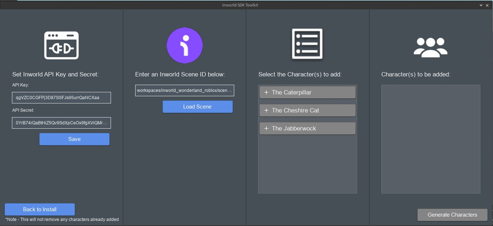
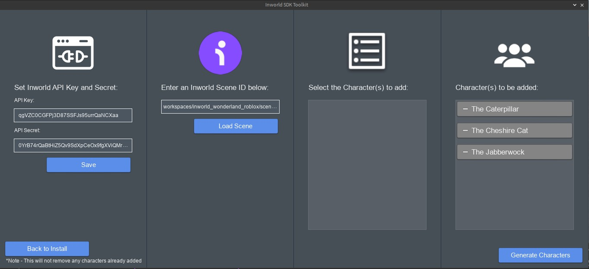

# Instalación y configuración del SDK de Roblox en Inworld

Para comenzar el proceso de integración del chatbot en Roblox utilizando Inworld AI, es necesario acceder a la plataforma oficial:
- Abre el navegador web de tu preferencia
- Dirígete a la página https://studio.inworld.ai
- Inicia sesión con tu cuenta de Inworld

Haz clic en el botón “Cambiar” (Change) para confirmar o modificar el espacio de trabajo activo

Es necesario seleccionar el espacio de trabajo Inworld adecuado para el proyecto.

Es indispensable acceder a la sección "Escenas" ubicada en el menú lateral izquierdo del Estudio Inworld. Para verificar la conectividad con el REST Simple Inworld, se debe seleccionar cualquier escena disponible y proceder a copiar su identificador mediante la opción "Copiar ID Legible por Máquina" localizada en el área izquierda de la interfaz.

Accede a la sección 'Integraciones' en el menú lateral del Estudio y guarda allí tanto tu clave API como el código secreto específicos para tu espacio de trabajo.

Desde su navegador web, descargue el complemento Inworld-SDK-Toolkit accediendo al enlace oficial de la página de Roblox.
Instale el complemento Inworld SDK Toolkit para Roblox haciendo clic en 'Obtener complemento'.

Inicie Roblox Studio y accede a la Toolbox, navega a la pestaña 'Plugins' y selecciona 'My Plugins' en el menú desplegable. Allí encontrarás el Inworld SDK Toolkit listo para usar.

Haga clic para abrir y luego seleccione 'Instalar.

El complemento se mostrará automáticamente en la pestaña 'Plugins' de Roblox Studio.

**Nota:** En Roblox Studio, active las opciones 'Permitir solicitudes HTTP' y 'Acceso de estudio a APIs' en la configuración del juego para compatibilidad con este SDK.

Selecciona el Inworld SDK Toolkit y haz clic en 'Instalar SDK' para iniciar la configuración. 
**Nota:** Requerirás una instalación independiente para cada nuevo juego. Haga clic en Instalar SDK.

Durante el proceso, aparecerán dos alertas de seguridad: una para autorizar la inyección de scripts y otra para permitir el acceso a studio.inworld.ai/api.inworld.ai. Seleccione 'Permitir' en ambas, luego pulse nuevamente 'Instalar SDK'. En caso de seleccionar 'Denegar' accidentalmente, consulte la sección de solución de problemas al final del documento.

Tras completar la instalación del SDK, el sistema mostrará automáticamente la pantalla 'Generar personajes'.

En el Explorador de Roblox Studio, observarás la incorporación automática de:
- Scripts esenciales.
- Elementos de interfaz gráfica (GUI).
- Sistema de eventos.
- Estructuras de datos.

Estos componentes corresponden a los archivos base del SDK que permiten la interacción conversacional con los personajes.

Dentro del complemento, copie su clave API y código secreto (obtenidos en la Parte 1) en la sección 'Configurar clave API Key y API Secret'. Finalice el proceso haciendo clic en 'Guardar'.

Una vez finalizada la configuración, podrás integrar tus personajes de Inworld. Asegúrate de tener tu navegador web abierto y accede a la sección 'Escenas' de tu cuenta Inworld. Selecciona la escena que contiene los personajes que deseas importar a Roblox y copia su 'ID legible por máquina' haciendo clic en el botón correspondiente. Este identificador permitirá la conexión entre los personajes y tu mundo en Roblox.

Regrese a Roblox Studio, acceda al Inworld SDK Toolkit y pegue el ID de escena copiado en el campo designado. Finalice el proceso haciendo clic en 'Cargar escena' para importar los personajes a su proyecto.

El sistema mostrará una alerta solicitando permiso para acceder a localhost:3000. Haga clic en 'Permitir' para continuar con la instalación. En caso de seleccionar 'Denegar' accidentalmente, podrá modificar esta configuración posteriormente en 'Configuración de seguridad del complemento'.

Tras cargar la escena, el sistema mostrará el listado completo de personajes disponibles. En nuestro ejemplo demostrativo, hemos utilizado la escena 'El Hongo de la Oruga' y seleccionado al personaje 'La Oruga' para su integración en Roblox.

Selecciona 'La Oruga' para integrarla a tu escena en Roblox. Este proceso es repetible: puedes cargar múltiples escenas para generar diversos personajes, incluso en sesiones posteriores. Cuando hayas añadido todos los personajes necesarios, finaliza el proceso haciendo clic en 'Generar Personajes'.

Finaliza el proceso cerrando el complemento Inworld SDK Toolkit. Verificarás que los personajes se han integrado correctamente en tu juego, representados inicialmente mediante Dummies de Roblox (modelos temporales que podrás personalizar posteriormente).

Para verificar el funcionamiento, ejecuta el juego desde Roblox Studio y aproxima tu avatar a cualquier personaje para iniciar una conversación. Al confirmar que el chat interactivo opera correctamente, habrás completado exitosamente todo el proceso de configuración.

