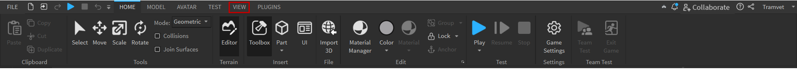
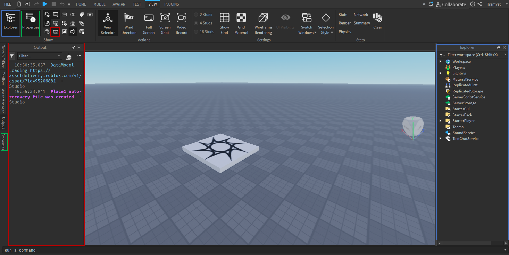
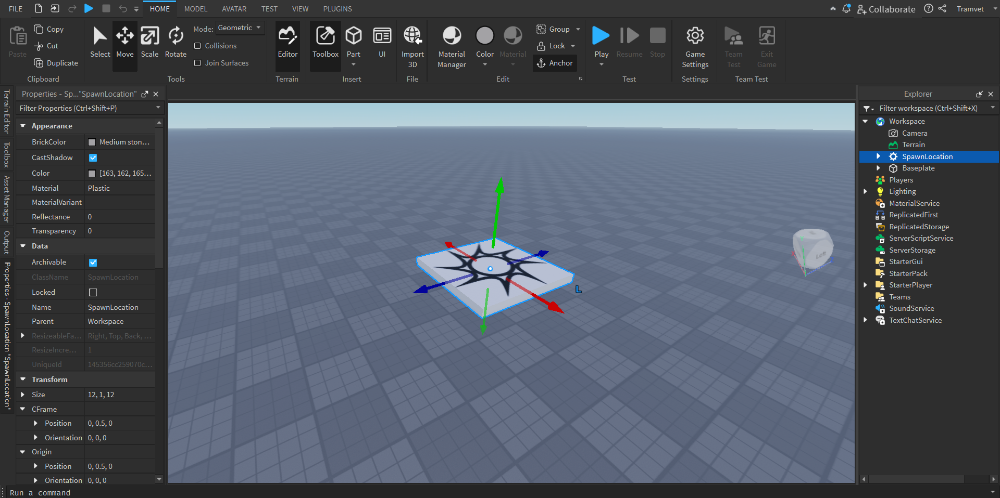
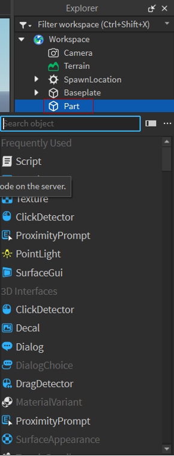
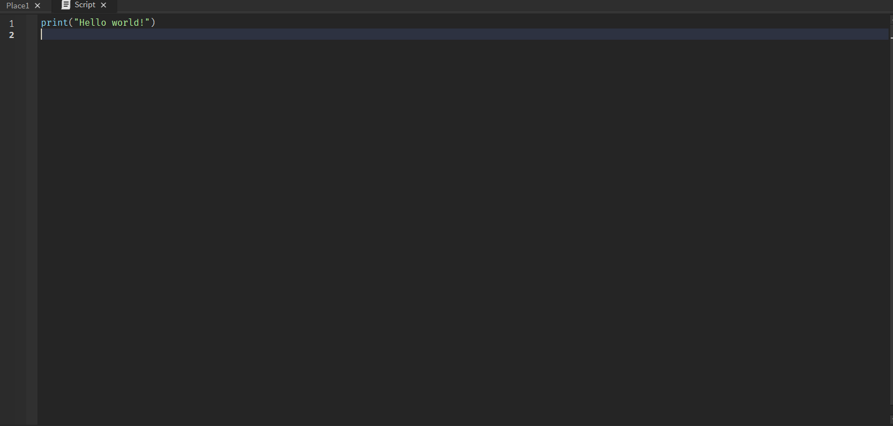

# "Mundos Virtuales para un Aprendizaje Inmersivo y Lúdico: Potenciando la Enseñanza de Anatomía Ósea en Terapia Física con IA”"

<div style="text-align: center;">
  
</div>

## Equipo de Desarrollo:
- `Programador:` Josafat Vargas Sánchez.
- `Diseño:` Nelly Carbajal Rincón.
- `Diseño:` Nancy Alejandra Tovar Pérez. 
- `Diseño:` Alma Priscila Martínez Castillo.
- `Programador:` Julio Cesar Gomez Eligio.


## Introducción
Bienvenido al documento del proyecto ”Mundos Virtuales para un Aprendizaje Inmersivo y Lúdico: Potenciando la Enseñanza de Anatomía Ósea en Terapia Física con IA" de desarrollado en Roblox Studio. Este documento tiene como objetivo tener un registro de toda la información completa sobre el diseño, la implementación y los objetivos del juego. A continuación, encontrarás información esencial para comprender el proyecto y colaborar de manera efectiva.

## Descripción breve del proyecto

El proyecto "Mundos Virtuales para un Aprendizaje Inmersivo y Lúdico: Potenciando la Enseñanza de Anatomía Ósea en Terapia Física con IA” se centra en el desarrollo de un juego educativo en Roblox Studio que utiliza la realidad virtual para ofrecer una experiencia de aprendizaje inmersiva y divertida. El juego estará enfocado en enseñar anatomía ósea de manera interactiva y efectiva, dirigido especialmente a estudiantes y profesionales de terapia física.


## Objetivos del proyecto
- Desarrollar un entorno virtual en Roblox Studio que simule con precisión el sistema óseo humano.
- Implementar mecanismos de interacción y exploración que permitan a los usuarios aprender sobre anatomía ósea de manera práctica y entretenida.
- Integrar inteligencia artificial para personalizar la experiencia de aprendizaje según el progreso y las necesidades individuales de los usuarios.
- Evaluar la efectividad del juego como herramienta de enseñanza en el ámbito de la terapia física mediante pruebas piloto y análisis de retroalimentación.
Público objetivo.

El público objetivo de este proyecto incluye principalmente a estudiantes de terapia física en formación, así como a profesionales de este campo que deseen mejorar sus conocimientos anatómicos de manera interactiva. Además, el juego también puede ser útil para educadores y profesores que buscan complementar sus lecciones con recursos digitales innovadores.

## Componentes del Proyecto
- `1.-Modelos 3D de Huesos:` Modelos detallados de huesos humanos que los usuarios pueden inspeccionar desde diferentes ángulos.
- `2.-Scripts de Interactividad:` Código que permite a los usuarios interactuar con los modelos 3D, recibir retroalimentación y realizar evaluaciones.
- `3.-Integración de IA:` Utilización de inteligencia artificial para adaptar el contenido y la dificultad según el progreso del usuario.
- `4.-Lenguaje de Señas:` Implementación de tutoriales en lenguaje de señas para mejorar la accesibilidad del contenido.

## Roblox Studio
Roblox Studio es la plataforma de desarrollo de juegos para Roblox, una plataforma de juegos en línea que permite a los usuarios crear y jugar juegos creados por otros usuarios. Roblox Studio proporciona a los desarrolladores todas las herramientas necesarias para crear juegos, modelar entornos 3D, programar scripts, y mucho más. Aquí te dejo un paso a paso sobre cómo instalar Roblox Studio:

## Instalación de Roblox Studio:
**Crea una cuenta en Roblox:**

Si aún no tienes una cuenta en Roblox, ve al sitio web oficial de Roblox (https://www.roblox.com/) y crea una cuenta.

- Descarga e instala Roblox Player:
- Después de crear tu cuenta, descarga e instala Roblox Player. Esto te permitirá jugar a juegos creados por otros usuarios.

**Descarga e instala Roblox Studio:**
- Para instalar Roblox Studio, ve al sitio web oficial de Roblox (https://create.roblox.com/) y sigue estos pasos:
- Haz clic en el enlace Empezar a Crear.
- Abre el archivo descargado e inicia el instalador.
- Sigue las instrucciones del instalador para completar la instalación.    

**Inicia Roblox Studio:**  

Una vez que la instalación haya finalizado, abre Roblox Studio. Puedes encontrar un acceso directo en tu escritorio o en el menú de inicio.

**Inicia sesión en Roblox Studio:**

Inicia sesión con la misma cuenta que creaste. Esto te dará acceso completo a las funciones de desarrollo de Roblox.
Recuerda que Roblox Studio es una herramienta poderosa, y puede llevar tiempo aprender todas sus funciones. Si eres nuevo en el desarrollo de juegos, considera empezar con tutoriales y ejemplos simples antes de abordar proyectos más grandes.

## Instrucciones de Uso

### Paso 1: Acceder a la Pestaña View

Diríjase a la pestaña `View` en la parte superior de la interfaz de Roblox Studio.



### Paso 2: Activar Explorador, Propiedades y Consola

En la pestaña `View`, asegúrese de activar las siguientes herramientas:

- <span style="color: blue;">**Explorador**</span>: Permite navegar por la jerarquía de objetos en el proyecto.
- <span style="color: green;">**Propiedades**</span>: Muestra las propiedades del objeto seleccionado.
- <span style="color: red;">**Consola**</span>: Utilizada para depurar y ver salidas de código.



### Paso 3: Organizar las Herramientas

Puede acomodar estas herramientas en la interfaz de Roblox Studio como más le convenga para facilitar su flujo de trabajo.

### Paso 4: Navegar y Modificar el Proyecto

Utilice el <span style="color: blue;">**Explorador**</span> para navegar por los distintos objetos y modelos del proyecto. El Explorador es una herramienta que permite ver y organizar todos los objetos y componentes de tu juego, facilitando la localización y gestión de los diferentes elementos de tu entorno virtual.

Seleccione un objeto para ver y modificar sus propiedades en la ventana de <span style="color: green;">**Propiedades**</span>. La ventana de Propiedades muestra las propiedades del objeto seleccionado en el Explorador. Aquí puedes ver y modificar atributos específicos del objeto, como su posición, tamaño, color, y otras características que determinan su comportamiento y apariencia en el juego.



### Paso 5: Ejecutar y Depurar

Utilice la <span style="color: red;">**Consola**</span> para ejecutar comandos y depurar scripts. La Consola, también conocida como Output, es esencial para detectar y corregir errores en tu código, ya que muestra mensajes de error, advertencias y otra información de diagnóstico que te ayuda a entender qué está sucediendo en tu juego y cómo solucionarlo.


### Inserción de un Script en el Workspace

Para añadir funcionalidad personalizada a tu juego en Roblox, es necesario insertar scripts en el Workspace. Sigue estos pasos para insertar y configurar un script:

1. **Acceder al Workspace**: En el panel `Explorer` de Roblox Studio, localiza y selecciona `Workspace`.

2. **Insertar un Objeto**: Haz clic derecho sobre `Workspace` y selecciona `Part` en el Signo de Mas(+) en el `Workspace`.

3. **Seleccionar Script**: Del menú desplegable de objetos a insertar, elige `Script`. Esto creará un nuevo script en el Workspace.



4. **Editar el Script**: Haz doble clic en el script recién creado para abrir el editor de scripts. Aquí puedes escribir o pegar el código necesario para la funcionalidad que deseas implementar.



6. **Implementar Funcionalidad**: Desarrolla la lógica del juego o aplicación dentro del script. Utiliza eventos y funciones para controlar interacciones, movimientos y otras acciones en tu juego.


Insertar scripts en el Workspace te permite extender la funcionalidad predeterminada de Roblox, creando experiencias interactivas y personalizadas para los jugadores. Explora las capacidades avanzadas de scripting en la documentación de Roblox para maximizar el potencial de tu proyecto.

## Lenguaje Lua en Roblox Studio

### ¿Qué es el Lenguaje Lua?

Lua es un lenguaje de programación liviano y flexible diseñado para ser embebido en otras aplicaciones. Fue desarrollado en Brasil en la década de 1990 y es conocido por su simplicidad, eficiencia y facilidad de integración con otros lenguajes y sistemas.

### Características de Lua:

- **Simplicidad**: Lua tiene una sintaxis simple y clara, lo que facilita su aprendizaje y uso.
- **Eficiencia**: Es un lenguaje rápido y eficiente, adecuado para aplicaciones que requieren un alto rendimiento.
- **Flexibilidad**: Lua es muy flexible y puede integrarse fácilmente con otros lenguajes y sistemas.
- **Ligereza**: Es un lenguaje liviano que consume pocos recursos, ideal para aplicaciones embebidas.

### ¿Por qué Lua en Roblox Studio?

Roblox Studio utiliza Lua como su lenguaje de scripting principal debido a varias razones:

1. **Facilidad de Aprendizaje**: Lua es accesible para principiantes, lo que permite a los nuevos desarrolladores aprender y comenzar a crear scripts rápidamente.
2. **Flexibilidad y Potencia**: A pesar de su simplicidad, Lua es un lenguaje potente que puede manejar una amplia variedad de tareas de scripting en Roblox.
3. **Integración Sencilla**: Lua se integra perfectamente con el entorno de desarrollo de Roblox Studio, permitiendo a los desarrolladores manipular objetos, eventos y propiedades del juego de manera eficiente.
4. **Rendimiento**: Lua ofrece un buen rendimiento en tiempo de ejecución, lo cual es crucial para los juegos en tiempo real desarrollados en Roblox.
5. **Comunidad y Soporte**: Lua tiene una comunidad activa y muchos recursos educativos disponibles, facilitando el aprendizaje y la resolución de problemas para los desarrolladores de Roblox.

### Ejemplo de Script en Lua:

A continuación, se muestra un ejemplo básico de un script en Lua dentro de Roblox Studio:

```lua
-- Este script imprime un mensaje en la consola cuando el juego empieza

-- Definir una función que imprime el mensaje
local function onGameStart()
    print("¡El juego ha comenzado!")
end

-- Conectar la función al evento 'Started' del juego
game:BindToClose(onGameStart)
```

## Conceptos Básicos para Programar en Lua

### ¿Qué es un Script?

Un `Script` en Roblox es un tipo de código que se ejecuta en el servidor y puede afectar a todos los jugadores en un juego. A diferencia de los `LocalScripts`, que solo se ejecutan en el cliente de un jugador específico, los `Scripts` en el servidor pueden realizar tareas globales como gestionar la física del juego, controlar la lógica de los objetos en el mundo, o interactuar con los datos del servidor.

#### ¿Dónde se Colocan los Scripts?

Los `Scripts` deben colocarse en áreas que se ejecuten en el servidor. Algunos de los lugares más comunes para colocar un `Script` incluyen:

- **Workspace**: Permite que el script interactúe directamente con los objetos y modelos en el mundo del juego.
- **ServerScriptService**: Es un lugar ideal para guardar scripts que no necesitan estar en el `Workspace` y que deben ejecutarse globalmente en el servidor.
- **ReplicatedStorage**: Ideal para scripts que necesitan ser accesibles tanto desde el servidor como desde el cliente.
- **Tool**: En un objeto `Tool`, permite que el script controle las herramientas que los jugadores pueden usar.

Al colocar un `Script` en estas ubicaciones, se asegura que el código se ejecute en el servidor y pueda controlar o modificar el entorno del juego para todos los jugadores.

### ¿Qué es un LocalScript?

Un `LocalScript` es un tipo de script en Roblox que se ejecuta en el cliente, es decir, en la computadora o dispositivo del jugador. A diferencia de los scripts normales (Scripts de Servidor), que se ejecutan en el servidor y afectan a todos los jugadores, los `LocalScripts` se ejecutan de manera individual para cada jugador, permitiendo realizar tareas específicas como controlar la cámara, manejar la interfaz de usuario (GUI) o escuchar eventos de entrada del jugador, como movimientos del ratón o pulsaciones de teclas.

#### ¿Dónde se Colocan los LocalScripts?

Los `LocalScripts` deben colocarse en áreas que se replican al cliente, lo que significa que solo funcionarán si están ubicados en las siguientes ubicaciones:

- **StarterPlayerScripts**: Se ejecutan automáticamente cuando el jugador entra en el juego.
- **StarterCharacterScripts**: Se ejecutan cuando el personaje del jugador se genera.
- **StarterGui**: Se utilizan para manejar elementos de la interfaz de usuario.
- **PlayerGui**: Se ejecutan en la GUI de un jugador específico.
- **Backpack**: Se colocan en la mochila del jugador y pueden ejecutarse cuando se selecciona una herramienta.

Estas ubicaciones aseguran que el `LocalScript` se ejecute correctamente en el cliente y pueda interactuar con las funciones específicas de ese jugador.

### Diferencias entre un Script y un LocalScript

En Roblox, los `Scripts` y los `LocalScripts` son dos tipos de scripts utilizados para diferentes propósitos. A continuación se detallan las principales diferencias entre ellos:

#### 1. **Ubicación de Ejecución**

- **Script**: 
  - Se ejecuta en el servidor.
  - Afecta a todos los jugadores del juego.
  - Se coloca en ubicaciones como `Workspace`, `ServerScriptService`, o `ReplicatedStorage`.

- **LocalScript**:
  - Se ejecuta en el cliente, es decir, en la máquina de cada jugador individualmente.
  - Afecta solo al jugador específico que lo está ejecutando.
  - Se coloca en ubicaciones como `StarterPlayerScripts`, `StarterCharacterScripts`, `StarterGui`, `PlayerGui`, o `Backpack`.

#### 2. **Acceso a Datos**

- **Script**:
  - Puede acceder y modificar cualquier dato del servidor.
  - Ideal para lógica global del juego, como manejo de datos de todos los jugadores, cambios en el entorno del juego, etc.

- **LocalScript**:
  - Solo puede acceder a datos que están disponibles en el cliente, como la interfaz de usuario, la cámara, y los controles del jugador.
  - Ideal para tareas que requieren interacción directa con el jugador, como manipulación de la cámara o respuesta a la entrada del usuario.

#### 3. **Seguridad y Privacidad**

- **Script**:
  - Es más seguro ya que se ejecuta en el servidor, lo que lo hace menos susceptible a ser manipulado por jugadores.
  - Usado para manejar lógica crítica que no debe ser alterada por los usuarios.

- **LocalScript**:
  - Menos seguro ya que se ejecuta en el cliente y podría ser manipulado por jugadores con malas intenciones.
  - Usado principalmente para funcionalidades que requieren personalización o respuesta rápida en el cliente.

#### 4. **Aplicaciones Comunes**

- **Script**:
  - Usado para manejar la física del juego, procesar eventos globales, interactuar con la base de datos, etc.

- **LocalScript**:
  - Usado para controlar la interfaz de usuario, manipular la cámara, escuchar eventos de entrada del jugador, etc.


### Variables y Tipos de Datos

En Lua, las variables se pueden declarar sin necesidad de especificar el tipo de datos, ya que es un lenguaje de tipado dinámico. Es recomendable usar `local` para declarar variables, ya que esto limita su alcance al bloque donde se definen, evitando conflictos de nombres y errores en el código.

```lua
local numero = 10          -- Número entero
local texto = "Hola Mundo" -- Cadena de texto
local booleano = true      -- Booleano
```

### Operadores 

Lua admite operadores aritméticos para cálculos matemáticos `(suma, resta, multiplicación, división, módulo y exponenciación)` y operadores de comparación para evaluar igualdades y desigualdades. También tiene operadores lógicos (`and`, `or`, `not`) para combinar o invertir condiciones y un operador de concatenación (`..`) para unir cadenas de texto. La precedencia de operadores en Lua determina el orden en que se evalúan las expresiones.

```Lua
-- Operadores aritméticos
local suma = 5 + 3
local resta = 5 - 3
local multiplicacion = 5 * 3
local division = 5 / 3

-- Operadores de comparación
local igual = (5 == 3)       -- false
local diferente = (5 ~= 3)   -- true
local mayor = (5 > 3)        -- true
local menor = (5 < 3)        -- false

-- Operadores lógicos
local y = (true and false)   -- false
local o = (true or false)    -- true
local no = not true          -- false
```

### Estructuras de Control

Lua ofrece diversas estructuras de control para gestionar el flujo de ejecución del programa. Estas incluyen `if`, `else` y `elseif` para ejecutar bloques de código basados en condiciones; `for` para bucles con un número específico de iteraciones; `while` para bucles que se ejecutan mientras una condición sea verdadera; y `repeat` para bucles que se ejecutan al menos una vez y continúan hasta que una condición sea falsa.
```Lua
-- Estructura if-else
local numero = 10
if numero > 5 then
    print("El número es mayor que 5")
else
    print("El número es 5 o menor")
end

-- Estructura for
for i = 1, 5 do
    print("Iteración: " .. i)
end

-- Estructura while
local contador = 1
while contador <= 5 do
    print("Contador: " .. contador)
    contador = contador + 1
end

-- Estructura repeat-until
local contador2 = 1
repeat
    print("Contador2: " .. contador2)
    contador2 = contador2 + 1
until contador2 > 5

```

### Funciones

En Lua, las funciones se definen con la palabra clave `function`, seguida del nombre de la función y sus parámetros entre paréntesis. Pueden devolver valores usando `return`. Las funciones pueden ser locales o globales, permitiendo modularidad y reutilización de código. Se invocan usando su nombre seguido de paréntesis y argumentos.

```Lua
-- Definir una función
local function saludar(nombre)
    print("Hola, " .. nombre)
end

-- Llamar a una función
saludar("Mundo")  -- Imprime: Hola, Mundo
```

### Manejo de Errores

Lua ofrece mecanismos como `pcall` y `xpcall` para manejar errores de manera efectiva. `pcall` intenta llamar a una función y captura cualquier error, devolviendo `true` si tiene éxito o `false` y el mensaje de error si falla. `xpcall` permite un manejo más avanzado de errores al especificar una función manejadora de errores personalizada. Estos métodos son cruciales para gestionar excepciones y mantener la estabilidad del programa al enfrentar condiciones inesperadas durante la ejecución del código Lua.

```Lua
-- Usando pcall para manejar errores
local status, err = pcall(function()
    error("¡Ha ocurrido un error!")
end)

if not status then
    print("Error: " .. err)
end
```

### Comentarios

En Lua, los comentarios de una línea se crean con `--`, mientras que los comentarios de varias líneas se delimitan con `--[[` y `]]`. Estos comentarios son útiles para documentar el código, explicar su funcionalidad y hacer anotaciones que ayuden a otros desarrolladores a entender el propósito y la lógica detrás de cada parte del programa.

```Lua
-- Este es un comentario de una línea

--[[
    Este es un comentario
    de varias líneas
]]
```

### Del Padre e Hijo en Roblox Studio

En Roblox Studio, los objetos en el entorno de juego están organizados jerárquicamente con una relación de padre e hijo. Esta estructura es fundamental para la organización y la interacción entre los elementos del juego.

- **Padre**: Es un objeto que contiene a otros objetos (hijos). Puedes imaginarlo como un contenedor que agrupa funcionalidades o elementos relacionados.
  
- **Hijo**: Es un objeto contenido dentro de otro objeto (padre). Los hijos heredan propiedades y comportamientos del padre y pueden ser manipulados y accedidos a través de él.

Esta relación padre e hijo es esencial para construir y gestionar la estructura y la lógica de tu juego en Roblox Studio. Al trabajar con scripts en Lua, es común interactuar con estos objetos utilizando métodos y propiedades que permiten acceder y manipular sus características dentro del entorno de juego.

#### Ejemplo de Declaración de Padre e Hijo

En este ejemplo, creamos un nuevo objeto de tipo `Part` como hijo de un objeto `Model`, que actúa como el padre:

```lua
-- Crear un nuevo Modelo (padre)
local modelo = Instance.new("Model")
modelo.Name = "MiModelo"

-- Crear un objeto Part (hijo)
local parte = Instance.new("Part")
parte.Name = "MiParte"

-- Establecer la parte como hijo del modelo
parte.Parent = modelo

-- Acceder a propiedades del hijo a través del padre
print(modelo.MiParte.Name)  -- Imprime: MiParte
```

### Acceder a las Propiedades del Workspace y de sus Objetos con un Script

En Roblox Studio, el `Workspace` es el contenedor principal que alberga todos los objetos del mundo del juego. A menudo, es necesario acceder y modificar las propiedades del `Workspace` y de los objetos que contiene mediante scripts.

#### Acceder al Workspace

Para acceder al `Workspace`, puedes usar la referencia global `game.Workspace`. Desde allí, puedes acceder a sus propiedades y a los objetos que contiene.

#### Ejemplo de Acceso y Modificación de Propiedades

En este ejemplo, accederemos al `Workspace` y modificaremos algunas propiedades de un objeto `Part` dentro de él.

1. **Crear una Parte en el Workspace**:
    - Abre Roblox Studio.
    - Inserta una nueva parte (`Part`) en el `Workspace`.

2. **Añadir un Script a la Parte**:
    - Selecciona la parte que creaste.
    - Haz clic derecho en la parte y selecciona `Insertar Objeto`.
    - Escoge `Script` del menú.
    - Copia y pega el siguiente código en el script:

```lua
-- Acceder al Workspace
local workspace = game.Workspace

-- Acceder a una parte específica dentro del Workspace
local parte = workspace:WaitForChild("Part")

-- Modificar las propiedades de la parte
parte.BrickColor = BrickColor.new("Bright red") -- Cambiar el color de la parte a rojo brillante
parte.Size = Vector3.new(10, 1, 10) -- Cambiar el tamaño de la parte
parte.Position = Vector3.new(0, 5, 0) -- Mover la parte a una nueva posición
```
-- Acceder y modificar una propiedad del Workspace
workspace.Gravity = 50 -- Cambiar la gravedad del mundo del juego
```

