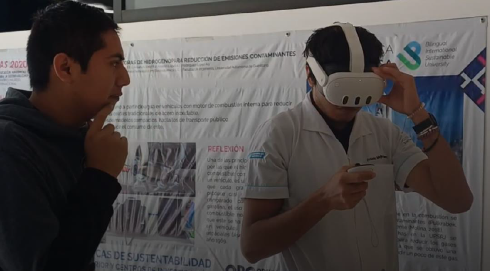

# Resultados Obtenidos

Durante la implementación del proyecto "Mundos Virtuales para un Aprendizaje Inmersivo y Lúdico: Potenciando la Enseñanza de Anatomía Ósea en Terapia Física", se obtuvieron resultados significativos tanto en aspectos técnicos como pedagógicos.

En términos técnicos, el entorno virtual desarrollado presentó un desempeño adecuado y fluido en la mayoría de los dispositivos utilizados durante las pruebas, incluyendo computadoras personales, laptops y dispositivos de realidad virtual (Meta Quest 3). Sin embargo, se observó que en teléfonos móviles existía un tiempo de carga ligeramente mayor debido a la complejidad y calidad visual de los modelos tridimensionales implementados. A pesar de esto, una vez cargado completamente, el entorno operó de manera estable y efectiva en todos los dispositivos probados.

Desde la perspectiva educativa y pedagógica, la retroalimentación recibida por parte de estudiantes y docentes fue altamente positiva. Aunque inicialmente algunos estudiantes expresaron reservas sobre el estilo de museo virtual, el resultado final fue muy bien recibido, destacando especialmente la calidad visual, la interactividad, y la accesibilidad del contenido presentado. Se reportó que la modalidad educativa inmersiva contribuyó efectivamente a fortalecer conocimientos previos sobre la anatomía ósea, generando interés y motivación adicionales hacia el aprendizaje de estos temas complejos. Varios estudiantes mencionaron explícitamente que les habría gustado contar con esta herramienta desde etapas más tempranas en su formación académica debido al potencial claro para facilitar y mejorar su comprensión del material.

Las pruebas iniciales (pretester) contaron con la participación de un grupo entre 20 y 30 estudiantes de la Licenciatura en Terapia Física de la UPSRJ. Los resultados específicos obtenidos de encuestas y entrevistas indicaron que los estudiantes preferirían controlar los modelos anatómicos directamente mediante métodos de entrada específicos según el dispositivo utilizado, tales como el mouse en computadoras personales, la pantalla táctil en teléfonos móviles, o los controles específicos en dispositivos de realidad virtual. Adicionalmente, sugirieron extender esta modalidad educativa al sistema muscular, evidenciando claramente la posibilidad de escalabilidad futura del proyecto.

Para complementar estos resultados, se incluyen una imagen del proyecto y la participación activa del equipo involucrado, lo cual proporciona evidencia visual adicional y respalda aún más los resultados descritos en esta sección.

